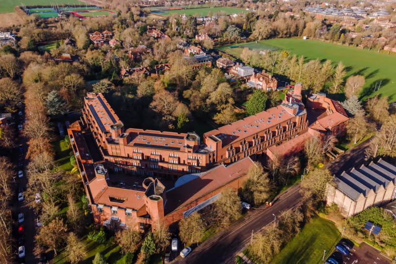
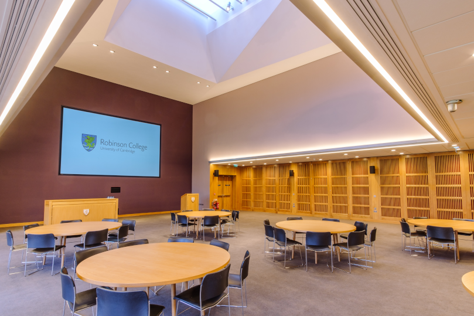
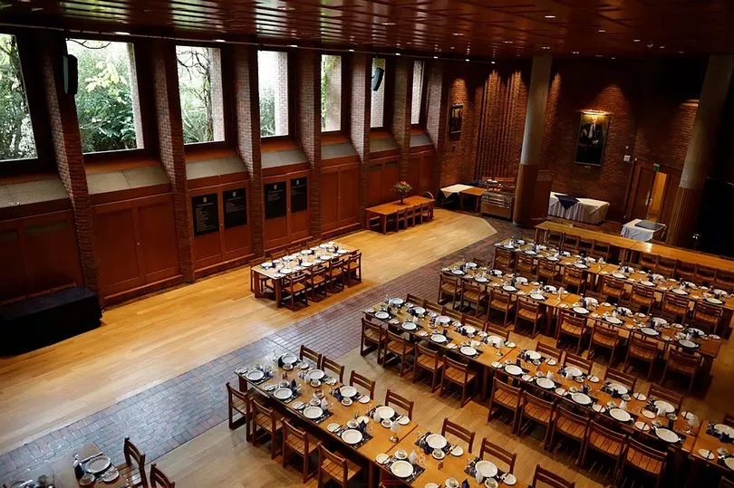
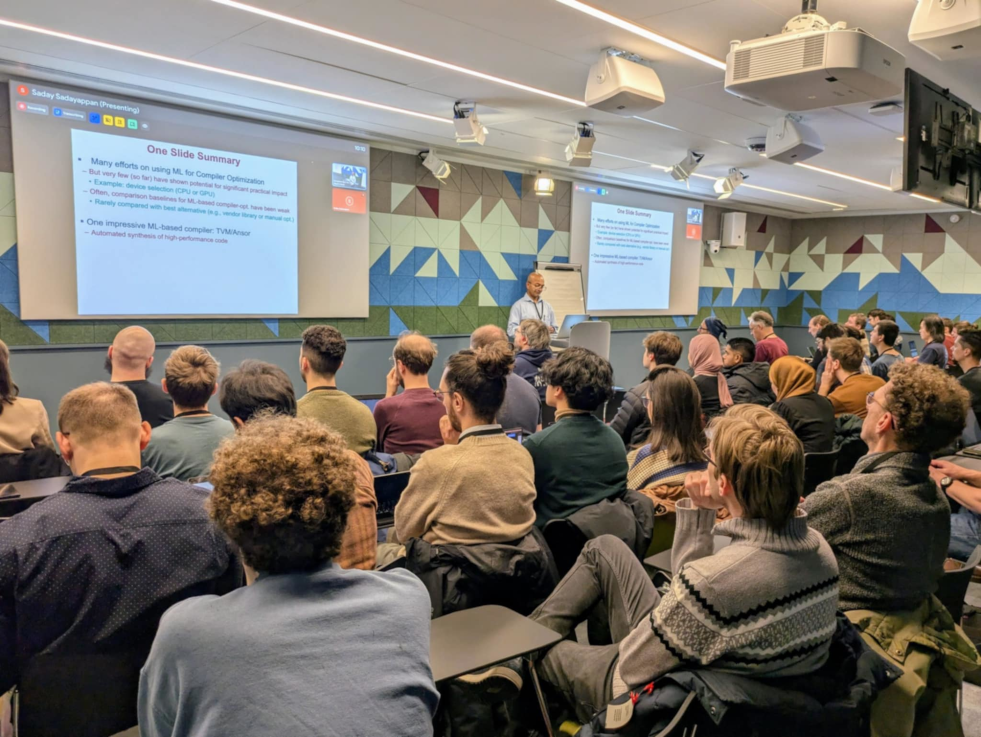
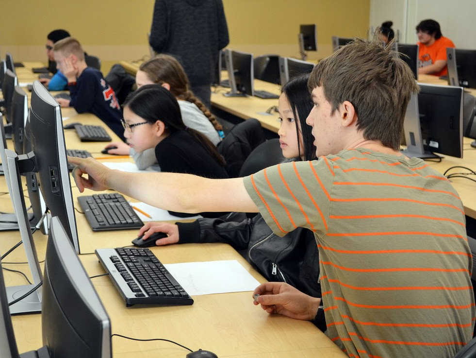
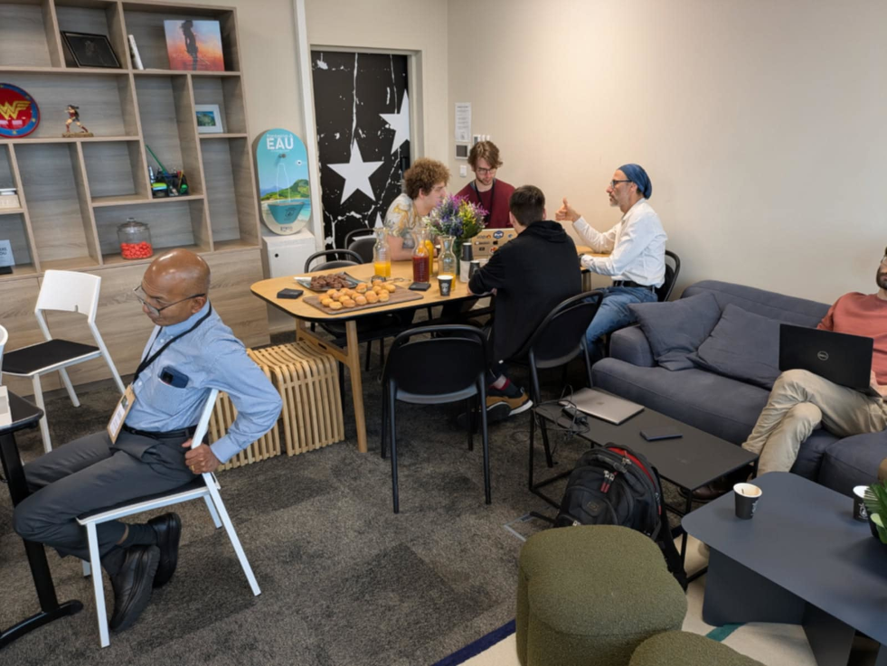

# 🇬🇧 See you in Cambridge, from September 8 to 12!

After Paris last January, the next edition of the MLIR school will take place in Cambridge, from September 8 to 12. We’ll be hosted in the welcoming setting of Robinson College, known for its vibrant scientific community, red brick architecture, and beautiful gardens 😉 Register now!

  
  
  

# 🚀 Getting your foot in the door

In recent years, MLIR-based compilers have seen widespread adoption in both academia and industry. MLIR has become a *de facto* standard in many sectors and a shared compiler infrastructure, allowing new projects to build upon sound and reliable existing solutions. The seasonal schools aim to facilitate the discovery and adoption of this growing, dynamic and innovative software ecosystem. 

  
  
  

